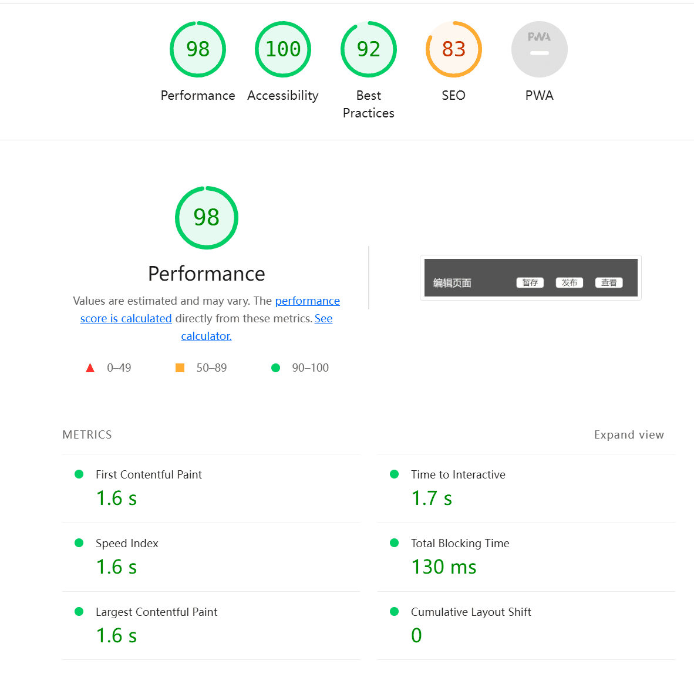

### 一、项目介绍

项目信息：低代码设计平台，通过拖拽组件生成静态页面，支持修改组件属性、样式，支持页面保存与查看。

项目地址：http://43.140.248.221:9000

Github 地址：https://github.com/niuhuiming/lowcode


### 二、项目实现

#### 2.1技术选型与相关开发文档

##### 2.1.1需求分析

- 提供文本、图片、按钮、视频、链接等组件
- 通过拖拽组件库中的组件摆放到画布中，实现页面布局
- 修改组件的属性，如：尺寸、颜色、组件内容
- 支持页面保存、发布
- 支持查看历史页面

##### 2.1.2详细设计及技术选型

**项目实现思路**

前端维护一个对象列表用于保存当前页面组件的布局与属性，调用渲染函数实现页面的加载。发布页面时将页面转为对应的`JSON`存入数据库，查看页面时依据`JSON`信息渲染页面。

**前端技术选型**

`Vue3` + `TypeScript` ，使用`Vite`进行项目搭建，使用`Vue Router`实现路由跳转。

**后端技术选型**

后端框架使用`Express`，数据库使用`MongoDB`。

#### 2.2页面配置

编辑页面是项目的主体，可以分为四部分：顶栏、物料区、画布区、编辑区。

1. 顶栏：实现对页面的管理功能，包括暂存、发布和查看功能
2. 物料区：展示一些基本的常用物料组件，包括文本、图片、按钮、视频、链接组件
3. 画布区：渲染拖拽过来的物料组件，能对选中组件进行编辑或删除
4. 编辑区：对选中组件的属性进行配置，并在画布中重新渲染

#### 2.3项目代码介绍

```
│  .gitignore
│  index.html
│  package.json
│  README.md
│  tsconfig.json
│  tsconfig.node.json
│  vite.config.ts
│  yarn.lock
│  
├─.vscode
│      extensions.json
│      
├─public
│      vite.svg
│      
└─src
    │  App.vue
    │  main.ts
    │  style.css
    │  vite-env.d.ts
    │  
    ├─assets	// 部分静态资源
    │      demo.mp4
    │      fj01.png
    │      fj02.png
    │      logo.png
    │      
    ├─components	// 组件库
    │      index.ts
    │      LinkComp.vue
    │      PicComp.vue
    │      TabList.vue
    │      TextComp.vue
    │      VideoComp.vue
    │      
    ├─router	// 路由
    │      index.ts
    │      
    ├─templates	// 组件处理器
    │      index.ts
    │      LinkComp.ts
    │      PicComp.ts
    │      TabList.ts
    │      TextComp.ts
    │      VideoComp.ts
    │      
    ├─utils	// 工具类
    │      emitter.ts	// 全局事件总线
    │      index.ts	// 工具
    │      
    └─views	// 页面
        │  EditPage.vue
        │  PageList.vue
        │  ShowPage.vue
        │  
        └─comps	// 页面组件
                CenterView.vue
                HeadTab.vue
                HeadView.vue
                LeftView.vue
                menuList.ts
                RightView.vue
```


### 三、测试结果

#### 3.1功能测试

- 组件拖拽摆放功能正常
- 通过属性面板改变组件样式正常
- 通过属性面板改变组件属性正常
- 暂存页面功能正常
- 发布页面功能正常
- 查看页面功能正常

#### 3.2性能测试

`Lighthouse`测试结果：




### 四、项目总结与反思

#### 4.1目前存在的问题

- 修改文本时响应式仍存在问题，未能有效保存
- 编辑页面下按钮组件的点击和移动组件时时点击还未作区分

#### 4.2已识别出的优化项

- 暂存页面的数据应保存到数据库而不是浏览器缓存，并且最好能做到自动保存而不是用户手动保存
- 在拖拽组件的`mouseover`阶段使用`transform`定位，在`mousedown`阶段再使用`position`定位，能减少页面回流次数

#### 4.3架构演进的可能性

- 对描述页面的`JSON`进行架构优化，调整为树形能更有效地去除冗余信息、增加组件的可扩展性。进一步的可以将单个页面用多个`JSON`文件描述，有利于在编辑巨量组件时提高页面加载速度和更新效率。
- 将核心编辑代码抽离，封装构建编辑引擎，实现低代码的多端（网页端、桌面端、移动端）支持。

#### 4.4项目的总结与反思

​        在项目开始前我对项目的整体架构做了充足的规划，了解了现有的一些低代码平台的实现思路，最终完成了这样一个低代码平台。虽说样式较为简陋，不过已经实现了项目的核心内容，在扩展组件和调整属性时都较为容易。在开发阶段我选择了之前没有使用过的`Vue3`和`TypeScript`，因为不熟悉而遇到了许多问题，磕磕绊绊回头再看，也是一次有益的尝试。

​        受限于时间和技术，此次项目仍有诸多改进之处，还待我去不断地探索。
